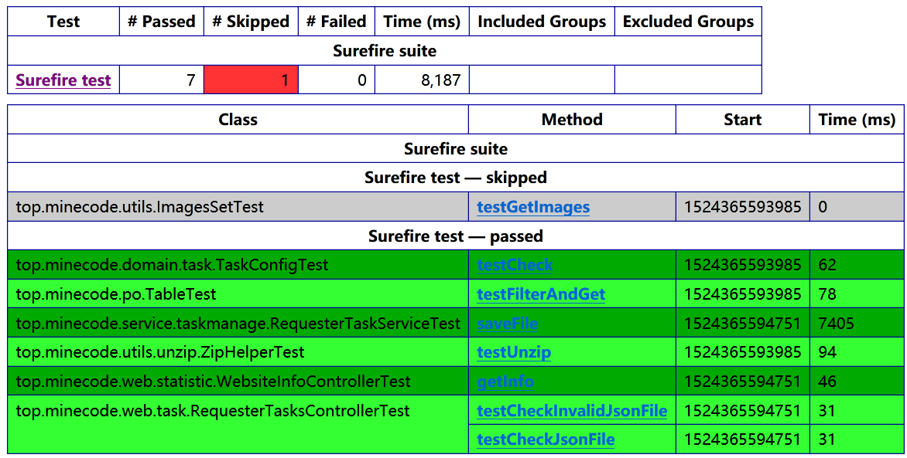

# 测试报告

## 更新记录

| 修改人员 | 日期        | 变更记录       | 版本号  |
| ---- | --------- | ---------- | ---- |
| 廖均达  | 2018-4-26 | 创建初稿       | 0.1  |
| 资源   | 2018-4-26 | 添加部分测试及其结果 | 0.2  |

## 概述

我们所使用的测试工具是TestNG，由于时间有限，没有编写所有的类的测试用例，只对部分较为重要的类进行了测试

## 测试用例报告

总执行情况：

Tests run: 8, Failures: 0, Errors: 0

| 测试用例类                        | 测试用例                     | 测试用例描述                                   | 执行情况 | 备注                         |
| ---------------------------- | ------------------------ | ---------------------------------------- | ---- | -------------------------- |
| RequesterTasksControllerTest | testCheckInvalidJsonFile | 测试检查错误的task.json文件时方法的正确性                | 通过   | 无                          |
|                              | testCheckJsonFile        | 测试检查正确的task.json文件时方法的正确性                | 通过   | 无                          |
| TaskConfigTest               | testCheck                | 测试TaskConfig类是否能正确读取task.json文件并进行正确性检查  | 通过   | 无                          |
| RequesterTaskServiceTest     | testSaveFile             | 测试RequesterTaskService中saveFile方法是否将传入的文件存入正确的位置并进行任务的分配 | 通过   | 无                          |
| TableTest                    | testFileterAndGet        | 测试Table类的filterAndGet方法能否正确执行            | 通过   | 无                          |
|                              | testLoad                 | 测试Table能否正确从文件系统中加载记录信息                  | 通过   | 无                          |
|                              | testSave                 | 测试Table能否正确将记录写入文件                       | 通过   | 无                          |
| WebsiteInfoControllerTest    | testGetInfo              | 测试getInfo方法能否得到正确json格式的网站信息             | 通过   | 无                          |
| ZipHelperTest                | testUnzip                | 测试ZipHelper解压文件时是否将文件解压到与压缩包同名的文件中以及是否返回了该文件夹的路径 | 通过   | 无                          |
| ImageSetTest                 | testGetImage             | 测试ImageSet能否正确地根据传入的图片路径读取图片并对图片进行分割     | 通过   | 由于需要本机的文件传入，故在测试通过后进行了Skip |
| TableFactoryTest             | testSaveAll              | 测试TableFactory是能能将所有的Table正确的写入文件中       | 通过   | 无                          |
| MockDataTest                 | workerAccessTest         | 测试WorkerTaskDao能否正确找到用户有权利接受的任务          | 通过   | 无                          |
|                              | workerSearchTest         | 测试WorkerTaskDao能否正确应对用户的关键字搜索            | 通过   | 无                          |
| TagDaoTest                   | testSaveTag              | 测试TagDao能否正确保存标注结果                       | 通过   | 无                          |
|                              | testGetTagResult         | 测试TagDao能否正确获取已经标注图片的标注结果                | 通过   | 无                          |
|                              | testGetNextPic           | 测试TagDao能否根据当前图片的路径获取下一张图片的路径            | 通过   | 无                          |
|                              | testGetPreviousPic       | 测试TagDao能否根据当前图片的路径加载上一张图片的路径            | 通过   | 无                          |
| TagResultTest                | test                     | 测试TagResult能否正确的被后端序列化、反序列化              | 通过   | 无                          |
|                              | test100                  | 测试100号任务对应的标注结果能否被正确的序列化和反序列化            | 通过   | 无                          |
|                              | test101                  | 测试101号任务对应的标注结果能否被正确的序列化和反序列化            | 通过   | 无                          |
|                              | test200                  | 测试200号任务对应的标注结果能否被正确的序列化和反序列化            | 通过   | 无                          |
|                              | test201                  | 测试201号任务对应的标注结果能否被正确的序列化和反序列化            | 通过   | 无                          |
|                              | test300                  | 测试300号任务对应的标注结果能否被正确的序列化和反序列化            | 通过   | 无                          |
|                              | test301                  | 测试301号任务对应的标注结果能否被正确的序列化和反序列化            | 通过   | 无                          |
|                              | test400                  | 测试400号任务对应的标注结果能否被正确的序列化和反序列化            | 通过   | 无                          |
|                              | test401                  | 测试401号任务对应的标注结果能否被正确的序列化和反序列化            | 通过   | 无                          |

## 自动生成的测试报告

